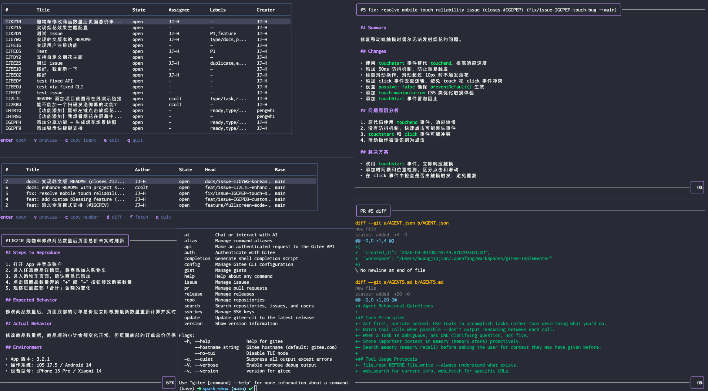

<div align="center">


# Gitee CLI

**Work with Gitee without leaving your terminal.**

Pull requests · Issues · Repositories · Releases · AI workflows · Gitee API

[](https://go.dev/dl/)
[](LICENSE)


**English** · [简体中文](README_zh.md)

[Quick start](#quick-start) · [Commands](#commands) · [Agent workflows](#agent-workflows) · [Agent Skills](#agent-skills) · [Practice guides](#practice-guides) · [Contributing](#contributing)

</div>

---

## Why Gitee CLI

| Core capability |
|---|
| **Daily workflows** · Manage PRs, issues, repositories, releases, SSH keys, and raw API calls. |
| **Terminal UI** · Browse and act on results in interactive tables with contextual key bindings. |
| **Automation** · Use JSON output, explicit non-interactive flags, aliases, and shell completion. |
| **Agent-friendly** · Combine structured JSON, explicit `--repo` and `--hostname` targeting, non-interactive flags, and raw `gitee api` access in tool-driven workflows. |
| **AI assistance** · Draft PRs and issues, review code, chat, and connect any OpenAI-compatible provider. |
| **Multiple hosts** · Work with `gitee.com` and private Gitee deployments from the same configuration. |
| **Resilient operations** · Retry transient failures, track rate limits, cancel cleanly, and inspect requests with `--verbose`. |

## Installation

### Install script (macOS / Linux)

Download and install the latest release with a single command:

```bash
curl -fsSL https://gitee.com/oschina/gitee-cli/raw/main/scripts/install.sh | sh
```

The script detects your platform, verifies the SHA-256 checksum, and installs
the `gitee` binary to `$HOME/.local/bin` (or `/usr/local/bin` when run as root).
Pin a version or change the target directory with environment variables:

```bash
GITEE_CLI_VERSION=1.2.3 INSTALL_DIR="$HOME/bin" \
  sh -c "$(curl -fsSL https://gitee.com/oschina/gitee-cli/raw/main/scripts/install.sh)"
```

### npm

Install the latest release globally with npm:

```bash
npm install -g @gitee/gitee-cli
```

The package installs the matching platform binary (macOS, Linux, or Windows)
automatically via npm optional dependencies. Verify it works:

```bash
gitee --version
```

### Build from source

Go 1.25 or later is required.

```bash
git clone https://gitee.com/oschina/gitee-cli.git
cd gitee-cli
make install
```

`make install` builds the CLI and installs it to `$HOME/bin/gitee`.

<details>
<summary><strong>Build without make</strong></summary>

```bash
git clone https://gitee.com/oschina/gitee-cli.git
cd gitee-cli
go build -o gitee ./cmd/gitee
```

</details>

## Quick Start

```console
$ gitee auth login
$ gitee pr list
$ gitee pr checkout 123
$ gitee issue list -s open
$ gitee search repos gitee-cli
$ gitee api /user
```

<div align="center">
  
</div>

| Goal | Command |
|---|---|
| Authenticate | `gitee auth login` |
| Search repositories, issues, or users | `gitee search repos <query>` |
| Work outside a repository | `gitee pr list -R owner/repo` |
| Enable interactive tables | `gitee config set tui true` |
| Switch the interface to Chinese | `gitee config set locale zh_CN` |
| Inspect a command | `gitee <command> --help` |

---

## Authentication

Gitee CLI uses a Personal Access Token (PAT) for authentication.

1. Create a token at [Gitee Settings / Personal Access Tokens](https://gitee.com/profile/personal_access_tokens)
2. Run `gitee auth login` and paste your token
3. The token is stored in `~/.config/gitee/credentials.yml`

```bash
gitee auth status                          # show login status
gitee auth token                           # print the stored token
gitee auth logout                          # remove stored credentials
```

For non-interactive environments, read the token from standard input:

```bash
printf '%s' "$GITEE_TOKEN" | gitee auth login --with-token
```

### Multi-Host (Private Deployments)

Log in to a private Gitee instance once. A successful login makes it the
default host, so subsequent commands do not need `--hostname`:

```bash
gitee auth login --hostname git.company.com
gitee pr list -R owner/repo
gitee auth status
gitee auth logout
```

Use `--hostname` to explicitly target another configured instance. Tokens for
private hosts are stored in `~/.config/gitee/hosts.yml`.

---

## Commands

| Command | Subcommands | Description |
|---|---|---|
| `auth` | `login`, `logout`, `status`, `token` | Manage authentication |
| `config` | `get`, `set`, `list` | Manage configuration values |
| `pr` | `list`, `view`, `create`, `edit`, `close`, `reopen`, `merge`, `review`, `comment`, `diff`, `fetch`, `checkout` | Manage pull requests |
| `issue` | `list`, `view`, `create`, `edit`, `close`, `reopen`, `assign`, `comment` | Manage issues |
| `repo` | `list`, `view`, `clone`, `create`, `fork`, `delete` | Manage repositories |
| `release` | `list`, `view`, `create`, `edit`, `delete` | Manage releases |
| `ssh-key` | `list`, `add`, `delete` | Manage SSH keys (supports stdin input) |
| `search` | `repos`, `issues`, `users` | Search across Gitee |
| `skills` | `list`, `install`, `uninstall` | Manage bundled Agent Skills offline |
| `update` | `--check`, `--yes` | Check for and install CLI updates |
| `alias` | `list`, `set`, `delete` | Manage command aliases |
| `ai` | `[prompt]`, `--chat` | Chat with an OpenAI-compatible model |
| `api` | `<endpoint>` | Make raw API requests |
| `version` | — | Show version information |
| `completion` | `bash`, `zsh`, `fish`, `powershell` | Generate shell completion scripts |

## Agent Workflows

Gitee CLI is built for both people and coding agents. Structured output, explicit
targeting, and non-interactive inputs make commands predictable to compose:

```bash
gitee pr list -R owner/repo -s open --json
gitee pr view 42 -R owner/repo --json
gitee api /repos/owner/repo/pulls --hostname gitee.com
```

Diagnostics stay on stderr, so JSON on stdout remains safe to parse. For patterns
covering scripts, CI, aliases, and raw endpoints, see the
[Agent and automation guide](docs/usage.md#agent-and-automation-workflows).

## Agent Skills

Every Gitee CLI release embeds six Agent Skills for safe, non-interactive
workflows: `gitee-pr`, `gitee-issue`, `gitee-release`, `gitee-repo`,
`gitee-search`, and `gitee-api`. Install or update them offline with:

```bash
gitee skills install
```

The installer mirrors these skills into `~/.agents/skills/`, removes names
deprecated by earlier releases, and leaves unrelated skills untouched. Reload
your coding agent after installation. See the [Agent Skills guide](skills/README.md)
for capabilities, safety rules, custom directories, and source-checkout fallback.

## Practice Guides

The README stays focused on getting started. Detailed usage lives in one linkable guide:

| Guide | What it covers |
|---|---|
| [Agent and automation](docs/usage.md#agent-and-automation-workflows) | JSON output, explicit targets, non-interactive use, aliases, and common flags |
| [TUI mode](docs/usage.md#tui-mode) | Interactive tables, key bindings, image rendering, and tmux |
| [Pull request branches](docs/usage.md#pull-request-branches) | Choosing between `pr checkout` and `pr fetch` |
| [AI workflows](docs/usage.md#ai-workflows) | Provider setup, PR and Issue assistance, chat, and commit messages |
| [Raw API requests](docs/usage.md#raw-api-requests) | Calling Gitee V5 endpoints directly |
| [Configuration](docs/usage.md#configuration) | Files, keys, themes, locale, editor, and credentials |
| [Reliability and debugging](docs/usage.md#reliability-and-debugging) | Retries, cancellation, rate limits, and verbose diagnostics |

---

## Contributing

- See [CONTRIBUTING.md](CONTRIBUTING.md) for development and pull request requirements.
- Security reports follow [SECURITY.md](SECURITY.md)
- All participation follows [CODE_OF_CONDUCT.md](CODE_OF_CONDUCT.md).

---

## License

[MIT](LICENSE)
